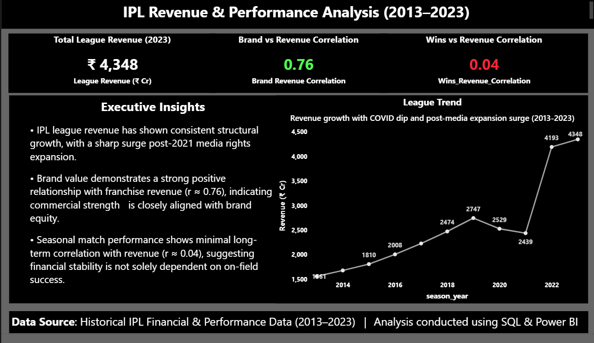
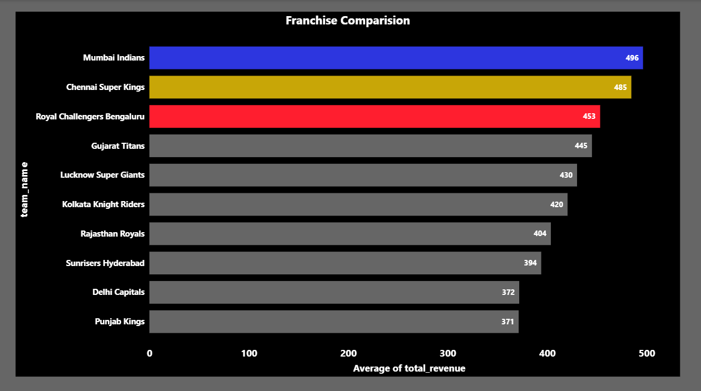
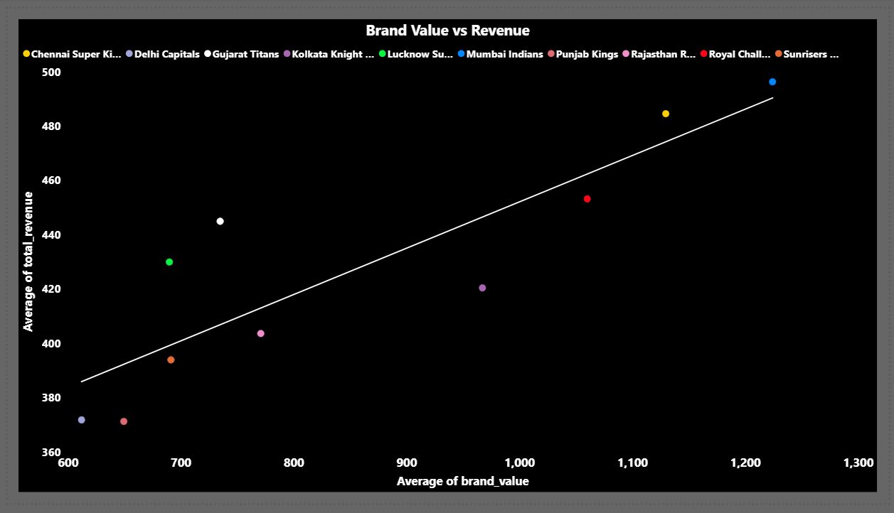
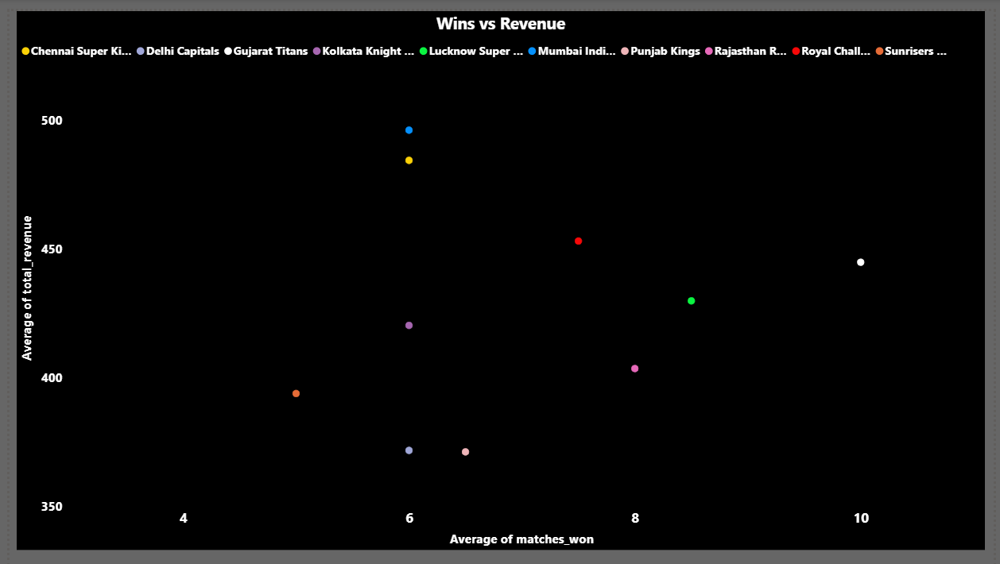

# IPL Revenue & Performance Analysis (2013–2023)
## 📖 Project Overview

This project analyzes IPL financial growth and franchise performance from 2013–2023 using PostgreSQL and Power BI. The objective was to evaluate structural revenue trends and examine whether brand value and on-field performance significantly influence franchise revenue.

## 🎯 Objectives
- Analyze league-wide revenue growth across 11 seasons. 
- Compare franchise-level financial performance
- Evaluate correlation between brand value and revenue.
- Evaluate correlation between match wins and revenue
- Identify structural growth patterns including COVID impact.

## Dataset Structure

### teams

| Column Name | Description |
|-------------|------------|
| team_id | Primary Key |
| team_name | Team name |

### seasons

| Column Name | Description |
|-------------|------------|
| season_id | Primary Key |
| season_year | Season year |
| total_revenue | Total league revenue |

### performance

| Column Name | Description |
|-------------|------------|
| performance_id | Primary Key |
| team_id | Foreign Key (references teams) |
| season_id | Foreign Key (references seasons) |
| matches_won | Matches won in season |
| brand_value | Franchise brand valuation |

A consolidated analytical view was created: vw_team_season_analysis

## 🛠️ Tools & Technologies

- PostgreSQL – Schema design, foreign keys, aggregation, correlation functions  
- SQL – Analytical queries, views, grouping, joins  
- Power BI – Dashboard development, DAX measures, KPI cards, regression visuals  
- Data Modeling – Relational normalization and structured schema design  

## Key Analysis Performed
- League revenue trend analysis (2013–2023)
- Franchise average revenue comparison
- Brand Value vs Revenue correlation
- Wins vs Revenue correlation
- COVID impact assessment
- Post-media-rights expansion surge analysis

## Key Insights
- IPL revenue has shown consistent structural growth with a sharp surge post-2022 media rights expansion.
- Brand value shows strong positive correlation with franchise revenue (r ≈ 0.76).
- Match wins show minimal long-term correlation with revenue (r ≈ 0.04).
- Established franchises maintain revenue dominance across economic cycles.

## 📊 Dashboard Preview

| Executive Summary | Franchise Comparison |
|-------------------|----------------------|
|  |  |

| Brand vs Revenue | Wins vs Revenue |
|------------------|------------------|
|  |  |

## 🚀 Project Impact
This project demonstrates:
- Relational database design
- Advanced SQL querying and aggregation
- Correlation analysis
- Data storytelling and executive reporting
- Dashboard design best practices
